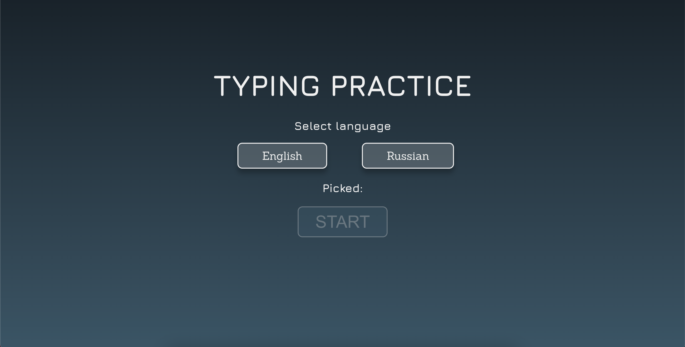
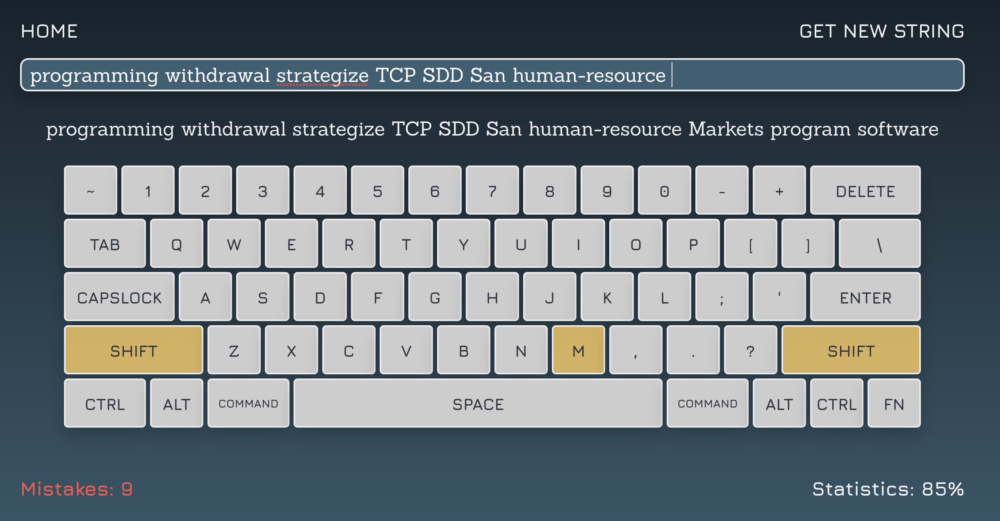
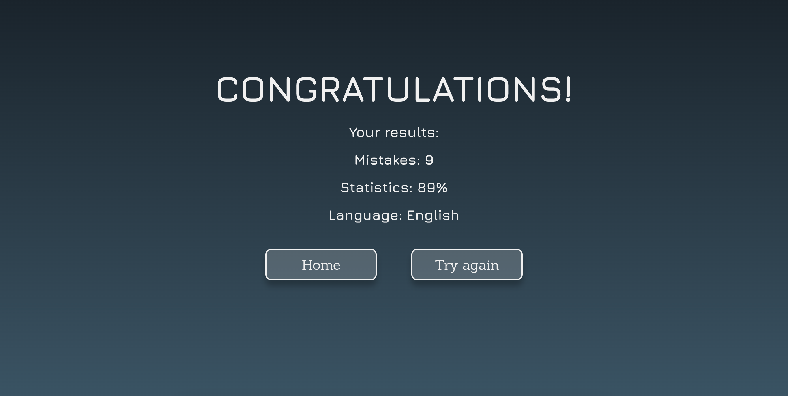

# **Typing practice app**

This app is made to practice touch typing on the keyboard as a pet-project.
You can test this app or practice typing [**here**](https://typing-practice-app.netlify.app).

In the development used:
- React JS
- TypeScript
- Redux Toolkit
- Formik

>

>

>

## Available Scripts

In the project directory, you can run:

### `yarn start`

Runs the app in the development mode.\
Open [http://localhost:3000](http://localhost:3000) to view it in your browser.
